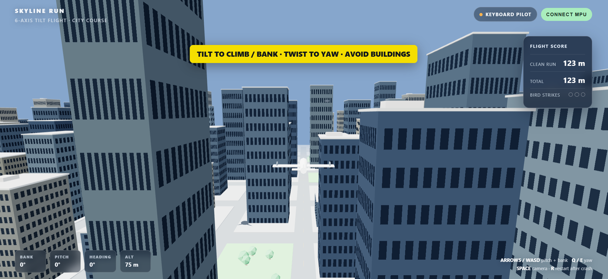

# Tilt Controlled Flight Game

A browser based 3D flight game that can be controlled with either the keyboard or an Arduino Uno and MPU6050 motion sensor. The Arduino reads the sensor, a small Python bridge sends the readings to the browser over WebSocket, and the browser turns them into flight controls.

## Preview

Keyboard-mode screenshot; the Arduino sensor was not connected for this view.

## What is included

- `flight_game.html` — the game and its keyboard controls.
- `serial_bridge.py` — forwards sensor readings between the Arduino and browser.
- `tilt_plane_controller/tilt_plane_controller.ino` — reads the MPU6050 and button, filters pitch and roll, and sends CSV data over USB serial.

## Try keyboard mode

Open `flight_game.html` in a modern browser. The game can be played without hardware:

- **Arrow keys** or **WASD**: pitch and bank
- **Q / E**: yaw
- **Space**: switch camera view
- **R**: restart after a crash

The game loads Three.js from a public CDN, so internet access is needed.

## Connect the Arduino controller

### Wiring

| Part | Arduino Uno |
| --- | --- |
| MPU6050 GND | GND |
| MPU6050 SDA | A4 / SDA |
| MPU6050 SCL | A5 / SCL |
| MPU6050 VCC | Follow the breakout board's voltage specification |
| MPU6050 AD0 | GND |
| Pushbutton | D2 to GND |
| Green LED | D4 through a resistor to GND |
| Red LED | D5 through a resistor to GND |

### Start the bridge

1. Install Python and the `pyserial` and `websockets` packages with `python -m pip install pyserial websockets`.
2. In `serial_bridge.py`, set `SERIAL_PORT` to the port for your Arduino (the original value is `COM3`).
3. Upload `tilt_plane_controller/tilt_plane_controller.ino` to the Uno.
4. Keep the sensor still and level while it starts; it briefly calibrates the gyro.
5. Run `python serial_bridge.py`.
6. Open the game in your browser. The bridge listens on localhost port `8765`.

The MPU6050 measures angular motion but has no compass, so yaw is a rate and not an absolute heading. This is a game controller demonstration, not a flight simulator.

## Status

This is a personal hardware and browser project. The files are shared with setup notes; using sensor control requires the listed hardware.

